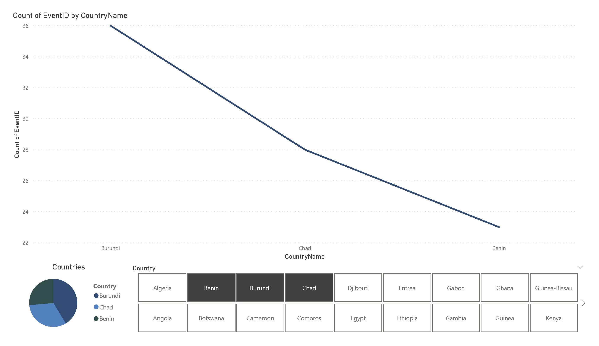

# Continent Timeline Exercise


## PowerBI, Excel and Python

Practiced web scraping by collecting and preparing all African BBC country profiles via [BBC Country Profiles](http://news.bbc.co.uk/2/hi/country_profiles/default.stm) using Python, then importing them into PowerBI to clean and turn into a timeline visual. 

### Links:
For country profiles page `http://news.bbc.co.uk/2/hi/country_profiles/default.stm`

Each country profile link is stored in `data/tl_links.csv`

## Final datasets generated
`final_timeline.csv` is a table of all the events that occurred from each countries:
Columns
| Column | Example | Data Type
| --------|:-------:| :-------:| 
| EventID | 1 | Number |
| EventYear | c. 600BC | Text |
| EventDescription | Carthaginians expand settlements along the North African coast.| Text
| CountryName | Algeria | Text |
| EventLink | http://news.bbc.co.uk/1/hi/world/middle_east/country_profiles/790556.stm | Text
| CountryID | DZ | Text |
| ConvertedYear | -600 |  Number |

`cids.csv` is a table mapping each country to their unique ids:

| Column | Example | Data Type
| --------|:-------:| :-------:| 
| CountryID | DZ | Text
| CountryName | Algeria | Text

`tl_links.csv` contains all country profile links and their corresponding countries:
| Column | Example | Data Type
| --------|:-------:| :-------:| 
| CountryName | DZ | Text
| Links | http://news.bbc.co.uk/1/hi/world/middle_east/country_profiles/790556.stm | Text

## Year table in Power BI 
I resolved the 19 remaining errors manually in Excel, then created a year table based on the corrected dataset from `final_timeline.csv` in Power BI. 
| Column | Example | Data Type
| --------|:-------:| :-------:| 
| ConvertedYear | -399.0 | Number

## Scripts used to collect and clean data
`fill_cids.py` for fixing missing country ids in the timeline table. The output from this is `updated_timeline_v2.csv`

`fix_century.py` for fixing any wrong year integer with 'EventYear' that contains the text 'century'. The output from this is `final_timeline.csv`

`fix_missing_links.py` for fixing missing links. Missing links were in other columns. This script went to each row and shifted three values three times so the links eventually got to their right columns. Output for this was `updated_timeline_v3.csv`

`fix_years.py` create a column to convert string event year into integers. The output from this is `updated_timeline.csv`

`get_all_events.py` for collecting all events on each country profile webpage using the `get_links.py` data generator output `data/raw_timeline.csv` to run a scrape timeline data function for each link in the table. 

`get_links.py` for collecting all links associated with the continent. Some African countries were listed as Middle Eastern, so we customized the code to assure to collected all data from all African countries by comparing them to our `make_cid.py` data generator output `data/cids.csv`.

`make_cid.py` for listing all country names and ids associated with the continent. We used two lists to create the table.

`merge_event_cid.py` for merging `get_all_events.py` output `data/raw_timeline.csv` with `make_cid.py` output `data/cids.csv` via a left join. This assigned the correct country ids with the correct country names. 


### File Hierarchy
```
├───data
│   ├───cleaned_data
│   └───old_data
├───images
├───power_bi
└───scripts
README.md
```

### Power BI Visuals


#### This diagram overs the number of events in each year, it has a slicer for the user to view country group, and it has a pike chart for each country. 


#### This diagram overs the number of events in each country.

### Notes

I did more manual editing on the datasets in Power Query editor, especially in the `EventYear` and `ConvertedYear` columns of the timeline dataset. 